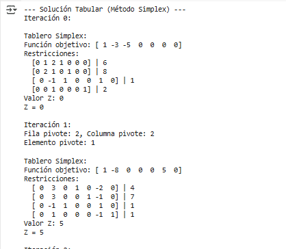
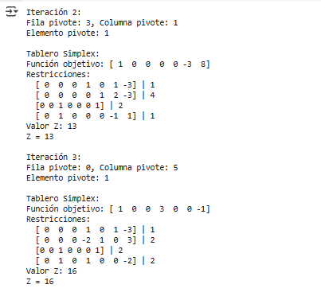
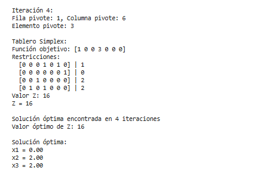
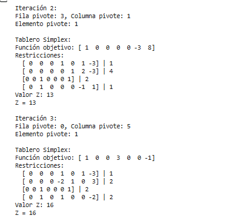
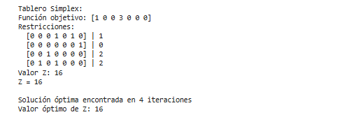
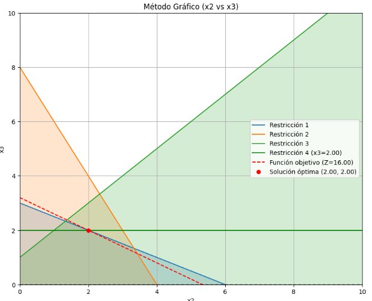
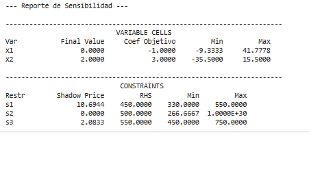

# 💻 Proyecto de Programación Lineal - Método Símplex

Este proyecto consiste en la implementación del **Método Símplex** para resolver problemas de **optimización lineal**, tanto de **maximización** como de **minimización**, con visualización gráfica en el caso de problemas con dos variables de decisión.

Desarrollado como parte del curso de **Investigación de Operaciones** en la **Universidad de Antioquia** – 2025.

---

## 👥 Integrantes del Grupo

- 🧑‍💻 Jonatan Romero  
- 🧑‍💻 Sebastián Berrio  
- 👨‍🏫 Profesor: **Ronald Akerman Ortiz García**

---

## 🎯 Objetivo del Proyecto

El objetivo es implementar, desde cero, una herramienta en **Python** que:

- Resuelva problemas de programación lineal utilizando el **Método Símplex (forma tabular)**.
- Genere **reportes de sensibilidad** automáticamente.
- Muestre gráficamente la **región factible** y la **solución óptima** para casos de 2 variables.

---

## ⚙️ Herramientas y Librerías Utilizadas

- 🐍 **Python 3.11+**
- 📊 `matplotlib` – para visualización gráfica
- 🧮 `numpy` – para álgebra lineal y manejo de matrices

Instalación rápida:
```bash
pip install matplotlib numpy

## ▶️ ¿Cómo ejecutar el proyecto?

1. Clona este repositorio en tu computador:
```bash
git clone https://github.com/usuario/proyecto-simplex.git
cd proyecto-simplex
```

Asegúrate de tener Python instalado. Luego instala las dependencias:
```bash
pip install numpy matplotlib
```

Ejecuta el programa:
```bash
python main.py
```

## 📌 Ejemplo de Problema Resuelto

**Función Objetivo:**  
Maximizar Z = 2X₁ + 5X₂

**Restricciones:**
```
X₁ + 6X₂ ≤ 20  
X₁ + X₂  ≤ 60  
X₁       ≤ 40  
X₁, X₂   ≥ 0
```

Este problema se resuelve paso a paso usando el algoritmo del símplex y al final se obtiene:

✅ La solución óptima  
🖥️ Detalle de cada iteración del método  
📈 Gráfica de la región factible con la función objetivo  
📋 Reporte de sensibilidad interpretando los resultados

## 📸 Evidencia del Funcionamiento

### 🔍 Consola - Método Símplex  
Aquí se muestra cómo evoluciona la tabla del método símplex en cada iteración:







### 📉 Gráfico de la Región Factible (Método Grafico Simplex)  






Una imagen que representa gráficamente el conjunto de soluciones viables:



### 📋 Reporte de Sensibilidad

Muestra cómo cambian los resultados óptimos si varían los coeficientes de la función objetivo o los lados derechos de las restricciones.

📌 En el reporte se incluyen:
- 🔢 Valores finales de las variables básicas (X1, X2)
- 💸 Precios sombra (shadow prices)
- 📉 Rangos de variación permitida para los coeficientes de la función objetivo
- 📏 Rangos de variación en el lado derecho (RHS) de las restricciones

🖼️ **Visualización del Reporte:**



✅ Este reporte permite analizar la estabilidad de la solución óptima y entender cómo pequeños cambios en los datos afectan los resultados.


## 🧠 Conclusiones

Aprendimos a implementar desde cero el método símplex y entender su funcionamiento interno.

Representamos gráficamente los problemas lineales para reforzar la comprensión visual.

Implementamos un análisis de sensibilidad básico que permite interpretar mejor los resultados obtenidos.

Este proyecto fue útil para reforzar nuestros conocimientos en programación lineal y algoritmos de optimización.

## 🏁 Licencia

Este proyecto fue desarrollado con fines educativos.  
Puedes usarlo y modificarlo libremente bajo los términos de la licencia MIT.

## 📘 Proyecto académico desarrollado en la Universidad de Antioquia (2025)  
👨‍🏫 Profesor guía: Ronald Akerman Ortiz García
